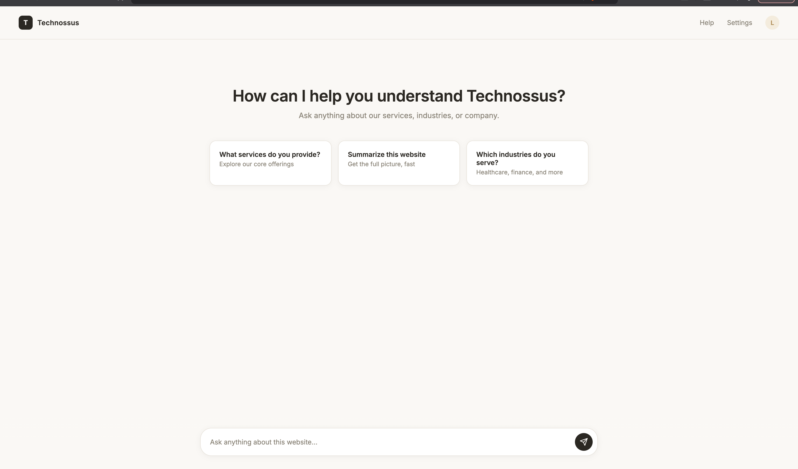
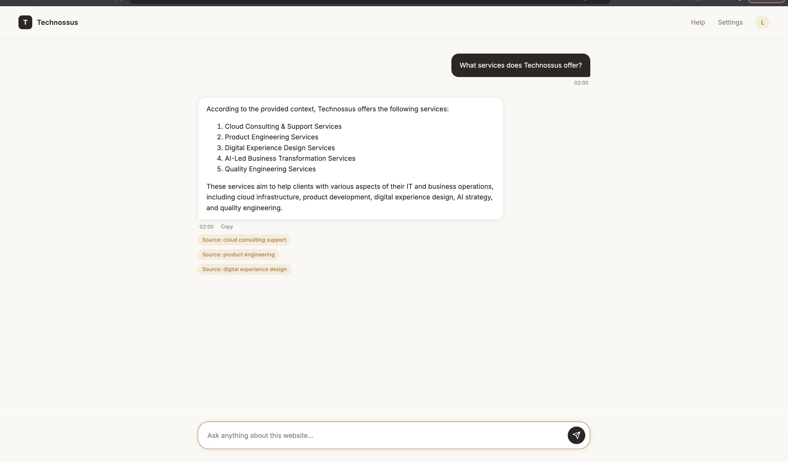

# Technossus Website RAG Chatbot

A chatbot that answers questions about Technossus using only what's actually on the Technossus website — no guessing, no making things up about the company.

Built this during my internship. The ask was simple to state: read the company site, answer questions about services, industries, company info. Getting it to actually answer reliably, instead of just sounding confident, was the harder part.

## What it actually does

You ask a question about Technossus. The app:

1. Has already crawled the entire Technossus site ahead of time, breadth-first from the homepage, stripping out nav bars, footers, and scripts so the noise that repeats on every page doesn't pollute what the chatbot learns from
2. Cuts each page into overlapping ~500-character chunks, tags each chunk with what kind of page it came from (services, industries, careers, etc.), and turns each chunk into an embedding stored in ChromaDB
3. Embeds your question the same way, runs a general similarity search across the whole site plus a second search restricted to the matching category if your question's wording hints at one (mentions "service," "industry," that kind of thing)
4. Merges and dedupes both result sets, builds a context block from the top chunks, and sends that plus your question to Groq's Llama 3.3 70B — told explicitly to only answer from the given context and say so if the answer isn't in there
5. Shows you the answer with the actual source pages it came from



## Why it's RAG and not just a chatbot with a system prompt

The model never gets to answer from what it "knows" about Technossus — it only gets to answer from chunks of real site content handed to it at query time, plus an instruction to admit it when the answer isn't in there. Retrieval first, generation second. If the site doesn't say it, the bot isn't supposed to say it either.

## The bug that actually mattered

Asking something as basic as "what services does Technossus offer" kept coming back incomplete, or with "I don't have that information" — even though the homepage has an entire section listing all six services.

Went through an actual debugging process instead of guessing:
- Checked the raw chunks being retrieved and their distance scores
- Tried a smaller chunk size — helped a little, didn't fix it
- Suspected ChromaDB was using the wrong distance metric — checked directly, it wasn't, cosine was already set up right
- Eventually landed on the real cause: a small general-purpose embedding model genuinely struggles to connect a plain question like "what services" to marketing copy that never phrases things the same way



Fixed it by tagging chunks with their URL category at ingestion time and adding a second, category-filtered search whenever the question's keywords pointed at one — so the system isn't relying purely on the embedding model guessing correctly on its own.

While wiring that fix in, also caught two plain Python bugs riding along with it: an indentation mistake that put the metadata-tagging line outside its loop, so almost every chunk ended up with the wrong or missing category tag; and a stale-connection issue where re-running ingestion rebuilds the ChromaDB collection under a new internal ID, but the FastAPI server kept holding a reference to the old, now-deleted one — 500 error until the server was manually restarted.

## Other stuff that broke

- **Crawler tried to fetch image files as pages.** URL normalization was adding a trailing slash to every URL before the check that filters out image/CSS/JS links ran — so `/logo.png` became `/logo.png/`, which no longer matched the file-extension filter. Caught this by testing the crawler against a small three-page mock site locally before pointing it at the real Technossus site. Fixed by only adding the trailing slash when the URL doesn't already look like a file.
- **First question after page load just reloaded the page instead of getting answered.** Every question after that worked fine. Turned out to be script load order — the markdown-rendering library was listed before my own `script.js`, and since browsers block on each script tag in order, a slow-loading CDN script could delay my code from attaching the form's submit handler in time, so the browser fell back to its default full-page-reload behavior. Fixed by loading `script.js` first, ahead of the external library.

## Did I actually check it works

Ran a set of test questions through it — services, industries, a specific case study, a capability I wasn't sure was actually listed (mobile app development), and a specific stat (client retention rate) — and cross-checked every answer against the actual raw crawled text using grep, instead of trusting that an answer merely sounded plausible.

Also wiped the generated data (`chroma_db`, the crawled pages) and re-ran the whole pipeline from a clean state, since that's closer to what actually happens the first time someone else sets this up from scratch.

## What this can't do

- The crawler stops at 150 pages as a safety limit — a much larger site wouldn't get fully indexed.

## How it's built

- **Backend:** Python, FastAPI, `requests` + BeautifulSoup (crawler), sentence-transformers (`all-MiniLM-L6-v2`) for embeddings, ChromaDB (cosine similarity), Groq API (Llama 3.3 70B)
- **Frontend:** plain HTML/CSS/JS, no framework, no build step — warm off-white and bronze palette styled to feel like a premium concierge assistant rather than a generic chat window

## Code layout

```
backend/
  crawler.py    breadth-first site crawl, strips boilerplate, normalizes URLs, writes manifest.json
  ingest.py     chunks pages, tags by category, embeds, stores in ChromaDB
  main.py       FastAPI /chat + /health endpoints, dual search, builds context, calls Groq

frontend/
  index.html    single-page chat interface, hero view -> chat view
  style.css     off-white/bronze theme, message bubbles, source badges, loading state
  script.js     sends questions, renders markdown answers, builds source badges, suggestion cards

backend/data/raw/    crawler output (rebuilt from scratch each run, not hand-edited)
backend/chroma_db/   vector database (rebuilt from scratch each run, not hand-edited)
```
